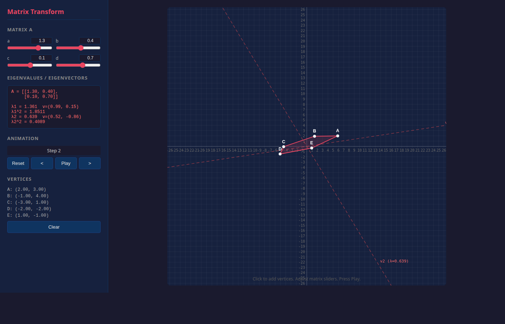
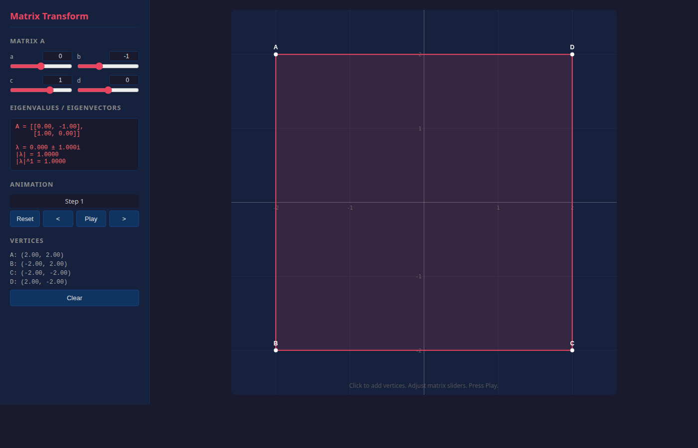

# Evolve

Interactive 2D matrix transformation visualizer. Define a polygon, apply a 2x2 matrix repeatedly, and watch it evolve step by step.

Built with Django (backend) and vanilla HTML5 Canvas + JavaScript (frontend). All computation runs client-side.

## Screenshots

### Real eigenvalues — Shear/scale matrix with eigenvector lines


### Complex eigenvalues — Pure rotation (90°)


## Features

- **N-gon support** — click on the canvas to add any number of vertices
- **2x2 matrix sliders** — adjust a, b, c, d in real time (range -3 to 3)
- **Eigenvalue/eigenvector display** — real and complex cases, shows cumulative powers
- **Eigenvector visualization** — dashed red lines along eigenvector directions
- **Step-by-step animation** — play/pause, step forward/back, reset
- **Auto-zoom** — canvas scale adapts to the full animation bounding box

## Quickstart

```bash
pip install -r requirements.txt
python manage.py runserver
```

Open [http://localhost:8000](http://localhost:8000)

## How to use

1. Click on the canvas to place vertices (3+ for a polygon)
2. Adjust the matrix sliders — eigenvectors and eigenvalues update in real time
3. Press **Play** to animate the repeated transformation
4. Use **<** and **>** to step through frames manually
5. Watch how eigenvalues accumulate: the sidebar shows each step

## Interesting matrices to try

| Matrix | Effect |
|--------|--------|
| `a=2, b=0, c=0, d=0.5` | Stretch x, compress y (real eigenvalues) |
| `a=0, b=-1, c=1, d=0` | 90° rotation (complex eigenvalues, \|λ\|=1) |
| `a=0.8, b=-0.6, c=0.6, d=0.8` | Rotation + scaling (\|λ\|=1) |
| `a=1, b=1, c=0, d=1` | Shear (repeated eigenvalue λ=1) |
| `a=1.3, b=0.4, c=0.1, d=0.7` | General (two distinct real eigenvalues) |

## Project structure

```
evolve/
  manage.py
  requirements.txt
  evolve_project/          # Django config
    settings.py
    urls.py
  transform/               # Single app
    views.py               # Serves the template
    urls.py
    templates/transform/
      index.html           # All frontend code (HTML + CSS + JS)
```

Zero models, zero API calls. Django serves a single HTML page. Everything runs in the browser.

## Origin

Ported from `quad.py`, a matplotlib CLI tool for visualizing how a 2x2 matrix transforms a quadrilateral. This web version adds interactivity, arbitrary polygons, and real-time eigenvalue display.
